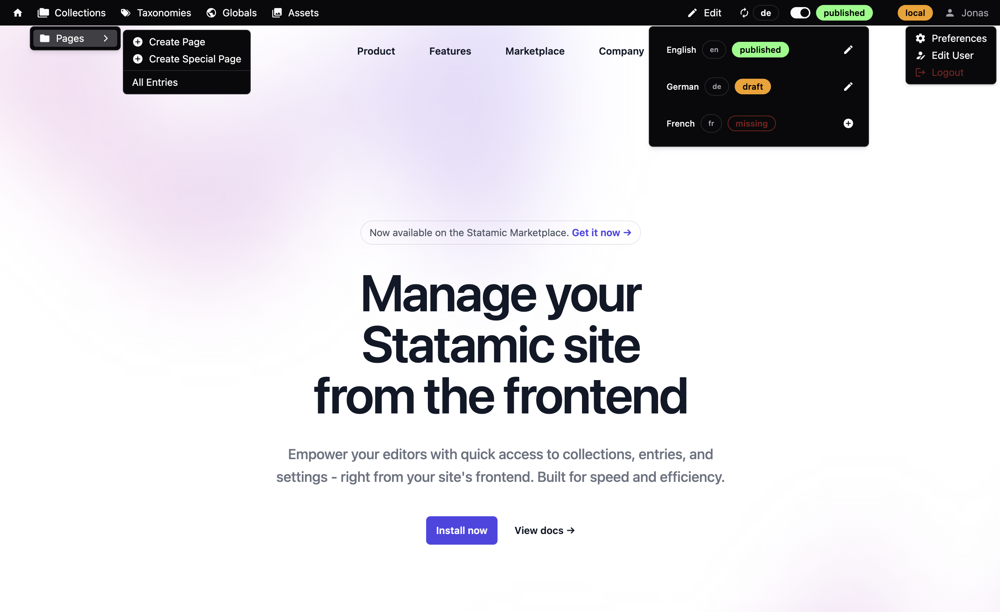

# Statamic Admin Bar Addon

> Empower your editors to manage your content from the frontend.

## Overview

The Statamic Admin Bar Addon provides an efficient way to navigate and manage your Statamic CMS content directly from your site's frontend.



## Key Features

- **Quick Access:** Instantly reach Statamic’s collections, taxonomies, globals, and assets.
- **Entry Actions:** Edit entries and toggle publish status with one click.
- **Multi-Site & Localization:** switch between multiple sites and localized content.
- **Light & Dark Mode:** Automatically adapt to your preferred visual theme.
- **Static/SSG Support:** Fully compatible with statically cached and SSG setups.
- **Role-Based Access Control:** give access to the admin bar to specific users or groups.
- **Customization:** Customize the admin bar via Statamic's preferences.

## Installation

Install the Addon via Composer:

```bash
composer require el-schneider/statamic-admin-bar
```

Add the `admin_bar` tag to your layout, right after the closing `</head>` tag.

```antlers
{{ admin_bar }}
```

## Permissions

The admin bar is only visible to users with the `access cp` and `view admin bar` permissions or super admins.
