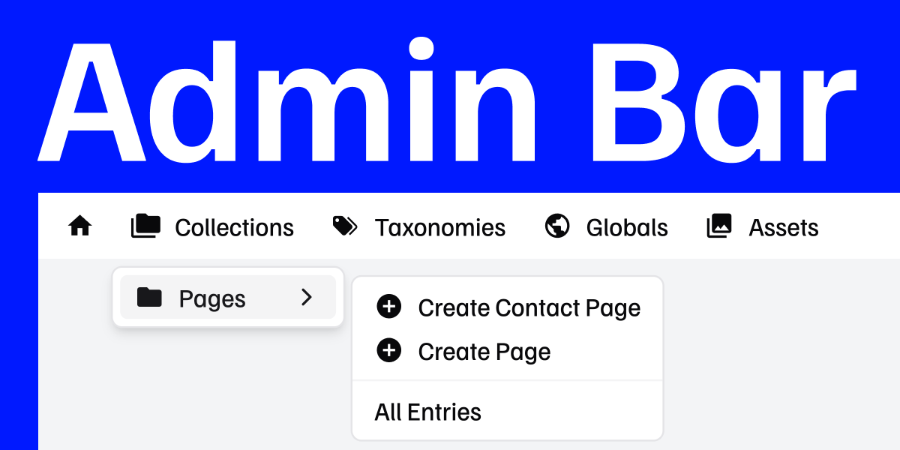

> ⚠️ This addon is currently in pre-release development and not ready for production use.



# Statamic Admin Bar Addon

> Manage your Statamic content right from the frontend.

## Overview

The Statamic Admin Bar Addon provides an efficient way to navigate and manage your Statamic CMS content directly from your site's frontend.

## Key Features

- **Quick Access:** Instantly reach Statamic's collections, taxonomies, globals, and assets.
- **Entry Actions:** Edit entries and toggle publish status with one click.
- **Cache Control:** Clear the various caches from the admin bar.
- **Multi-Site & Localization:** switch between multiple sites and localized content.
- **Light & Dark Mode:** Automatically adapt to your preferred visual theme.
- **Half/Full Measure Caching:** Fully compatible with different caching strategies.
- **Role-Based Access Control:** give access to the admin bar to specific users or groups.
- **Customization:** Customize the admin bar via Statamic's preferences.

## Installation

Install the Addon via Composer:

```bash
composer require el-schneider/statamic-admin-bar
```

Add the `admin_bar` tag to your layout, right after the opening `<body>` tag.

```antlers
{{ admin_bar }}
```

## How to use admin bar with fixed menu?

For your convenience we provide a global CSS custom property `--admin-bar-height`. You can use this to offset other fixed navigations. It will only be set if the admin bar is visible.

```css
.your-fixed-nav {
    top: var(--admin-bar-height, 0px);
}
```

## Permissions

The admin bar is only visible to users with the `access cp` and `view admin bar` permissions or super admins.

## Font License Information

This plugin includes the Familjen Grotesk font, which is licensed under the [SIL Open Font License, Version 1.1](http://scripts.sil.org/OFL).

For detailed information about the font license, please refer to the `OFL.txt` file included in this package.

### Acknowledgements

We would like to extend our gratitude to the authors of the Familjen Grotesk font for their contributions, which allow us to utilize and modify this font in our plugin.
